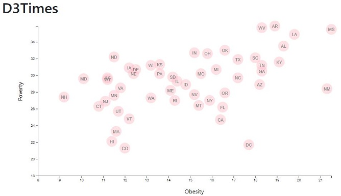

# D3-challenge- Data Journalism and D3

## Background

This is a project of data visualization for a major metro paper.

I'm tasked with analyzing the current trends shaping people's lives, as well as creating charts, graphs, and interactive elements to help readers understand your findings.

The editor wants to run a series of feature stories about the health risks facing particular demographics. She's counting on me to sniff out the first story idea by sifting through information from the U.S. Census Bureau and the Behavioral Risk Factor Surveillance System.

The data set included with the assignment is based on 2014 ACS 1-year estimates from the [US Census Bureau](https://data.census.gov/cedsci/). The current data set includes data on rates of income, obesity, poverty, etc. by state. MOE stands for "margin of error."

Using the D3 techniques I created a scatter plot between two of the data variables `Obesity` and `Poverty`.

This scatter plot represents each state with circle elements.

- - -

Next elements:

Include more demographics and more risk factors.

Incorporate d3-tip.

